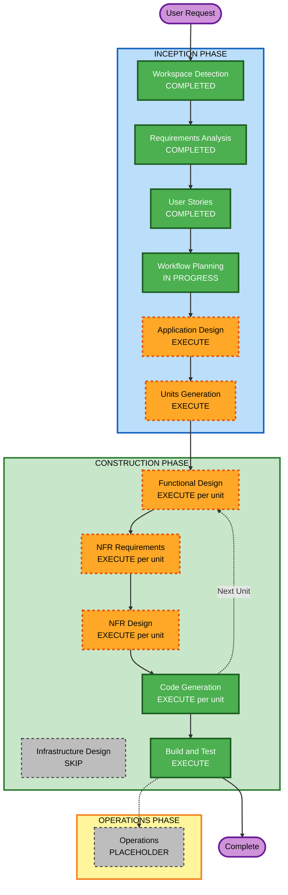

# Execution Plan — Expense Tracker

## Detailed Analysis Summary

### Transformation Scope
- **Project Type**: Greenfield — no existing codebase, no transformation/brownfield concerns apply.

### Change Impact Assessment
- **User-facing changes**: Yes — the entire app is new, user-facing functionality (24 stories across 8 epics).
- **Structural changes**: Yes — this is a new system; architecture must be established from scratch (data layer, state management, navigation, notification/backup services).
- **Data model changes**: Yes — new Isar collections for Expense, Budget, Category, Settings (per PRD Section 10 / requirements.md).
- **API changes**: N/A — no network APIs; internal module interfaces will be defined in Application Design.
- **NFR impact**: Yes — performance (2s launch, 60 FPS, 500,000+ records), offline-only operation, battery efficiency, and the enabled Resiliency/Security/PBT extensions all carry NFR weight.

### Risk Assessment
- **Risk Level**: Medium — single-developer-scale greenfield build with a fixed, well-documented tech stack (lower risk), but broad feature surface and a large-scale local-data performance requirement (500k+ records with Isar) introduce moderate technical risk.
- **Rollback Complexity**: Easy — greenfield project, no production users yet; rollback = revert commits.
- **Testing Complexity**: Moderate — business logic (budget thresholds, aggregation, filtering) benefits from property-based testing (enabled extension); UI/animation polish requires manual verification.

## Workflow Visualization

## Phases to Execute

### INCEPTION PHASE
- [x] Workspace Detection (COMPLETED)
- [x] Reverse Engineering (SKIPPED — greenfield, no existing code)
- [x] Requirements Analysis (COMPLETED)
- [x] User Stories (COMPLETED)
- [x] Execution Plan (IN PROGRESS)
- [ ] Application Design — **EXECUTE**
  - **Rationale**: The app needs new components/services defined from scratch — a data/repository layer over Isar, a budget-calculation service (combined + per-ledger modes, threshold evaluation with the "no re-fire" rule), a notification service, a backup/export service, and state-management (Riverpod) providers wiring screens to that logic. These component boundaries and their business-rule responsibilities aren't yet defined and directly affect how Units Generation should split the work.
- [ ] Units Generation — **EXECUTE**
  - **Rationale**: 24 stories across 8 epics and 4 PRD phases is too much to design/build as one unit. Decomposing into units (e.g., Core Data & Categories, Budgeting & Notifications, Dashboard & Onboarding, Search/Filter/Reports, Backup/Export/Settings, Premium Polish) lets each unit go through Functional/NFR Design and Code Generation independently, in an order that respects dependencies (e.g., data layer before reports).

### CONSTRUCTION PHASE
*(Executed per-unit, once Units Generation defines the units)*
- [ ] Functional Design — **EXECUTE** (per unit, where applicable)
  - **Rationale**: Several units contain new data models (Expense, Budget, Category, Settings schemas) and non-trivial business logic (budget percentage/threshold recalculation rules, category aggregation, filter/sort combination logic, export/import round-trips) that need detailed design before coding. Also required to satisfy PBT-01 (testable-property identification must occur during Functional Design, per the enabled Property-Based Testing extension).
- [ ] NFR Requirements — **EXECUTE** (per unit, where applicable)
  - **Rationale**: Although the core tech stack (Flutter/Isar/Riverpod/Go Router/FL Chart/flutter_local_notifications) is fixed by the PRD, unit-level NFR requirements are still needed to cover: local-storage indexing/query strategy for 500,000+ records (NFR-2), the PBT framework selection for Dart (PBT-09), and confirming which Security Baseline rules are N/A vs. applicable for each unit (e.g., SECURITY-01 local encryption applies to the data unit; SECURITY-04/08/12 are N/A for units with no network/auth surface).
- [ ] NFR Design — **EXECUTE** (per unit, where applicable)
  - **Rationale**: Follows directly from NFR Requirements — e.g., designing the local-data encryption approach, crash-safe/atomic backup writes (Resiliency local-data analog), and the PBT generator/test structure for each unit's business logic.
- [ ] Infrastructure Design — **SKIP**
  - **Rationale**: No cloud infrastructure, no deployment topology, no backend services exist for this app (confirmed in requirements.md and PRD Section 12). Infrastructure Design maps to real infrastructure services, which don't apply to a fully offline, local-only mobile app.
- [ ] Code Generation — **EXECUTE (ALWAYS, per unit)**
  - **Rationale**: Implementation and tests must be generated for every unit.
- [ ] Build and Test — **EXECUTE (ALWAYS)**
  - **Rationale**: Build instructions, unit/integration/PBT test execution instructions needed across all units before considering the app complete.

### OPERATIONS PHASE
- [ ] Operations — PLACEHOLDER
  - **Rationale**: Future deployment/monitoring workflows; not applicable to this offline mobile app in its current form (no deployment pipeline requested).

## Package/Unit Update Sequence

Not yet finalized — will be determined during Units Generation based on dependencies (e.g., the data/category layer is a prerequisite for budgeting, reporting, and backup/export units). A proposed sequence will be presented at that stage.

## Estimated Timeline
- **Total Phases**: 2 remaining INCEPTION stages (Application Design, Units Generation) + per-unit CONSTRUCTION loop (Functional Design → NFR Requirements → NFR Design → Code Generation, repeated per unit) + Build and Test.
- **Estimated Duration**: Not time-boxed — AI-DLC proceeds stage-by-stage with your approval at each gate; actual calendar time depends on your review pace, not fixed sprints.

## Success Criteria
- **Primary Goal**: A working, offline-first Flutter Android expense tracker implementing all 24 approved user stories across all 4 PRD phases.
- **Key Deliverables**: Application design (component/service boundaries), unit breakdown, functional/NFR designs per unit, working Dart/Flutter code with tests (including property-based tests for budget/aggregation/export logic), build and test instructions.
- **Quality Gates**: Security Baseline and Resiliency Baseline compliance summaries (with confirmed N/A determinations) at each applicable stage; PBT compliance summary at Functional Design and Code Generation stages; all user story acceptance criteria satisfied.
